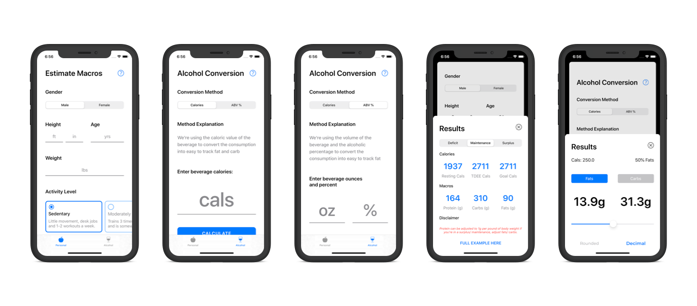

# Alcohol And Macro Calculator
> Convert your alcohol consumption into easy to track macros and also calculate your daily macronutrient needs based on age, gender, height, weight, and activity level.

[![Swift Version][swift-image]][swift-url]

The macro calculator app helps you easily calculate your daily macronutrient needs while adjusting certain inputs and based on your current dietary goals. 

Also, you can easily use the app to track alcohol consumption in the form on fats and carbs.

## Features

- [x] Dark Mode
- [x] No Sign-In Required
- [x] Real Time Updates
- [x] No Wasted Load Time

## Requirements

- iOS 11.3+
- Xcode 11.0

## Technologies

- XCode 11
- UIKit
- Swift 5
- UICollectionView
- UIStackView
- Custom Calculations

## Contact

Ben Patterson – benjpatt48@gmail.com

Personal Website - [https://benjpatt.com](https://benjpatt.com/)

Find My GitHub - [https://github.com/benpatterson48](https://github.com/benpatterson48)

[swift-image]:https://img.shields.io/badge/swift-5.0-orange.svg
[swift-url]: https://swift.org/
